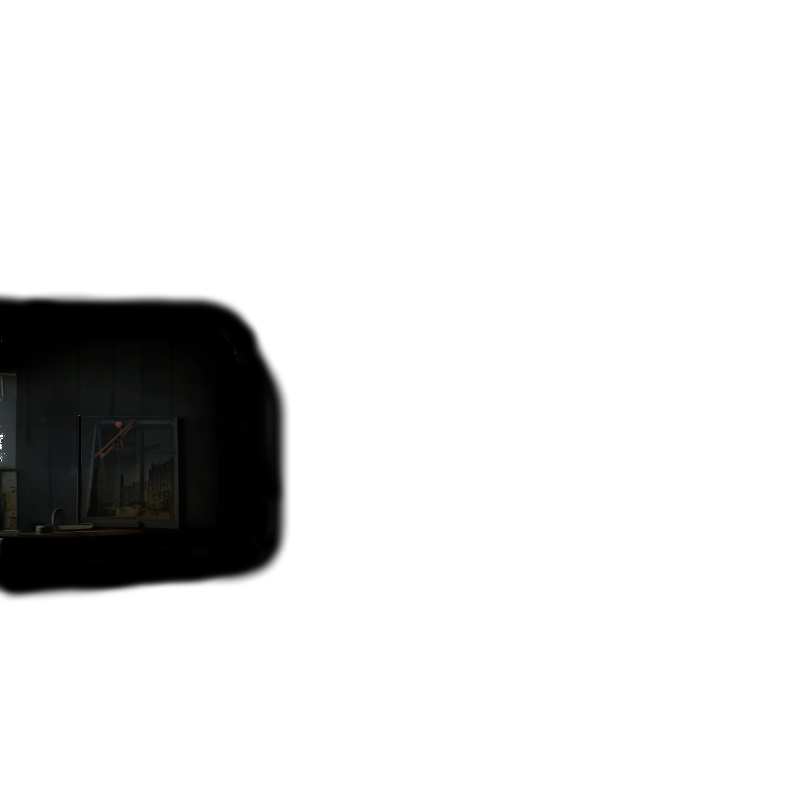
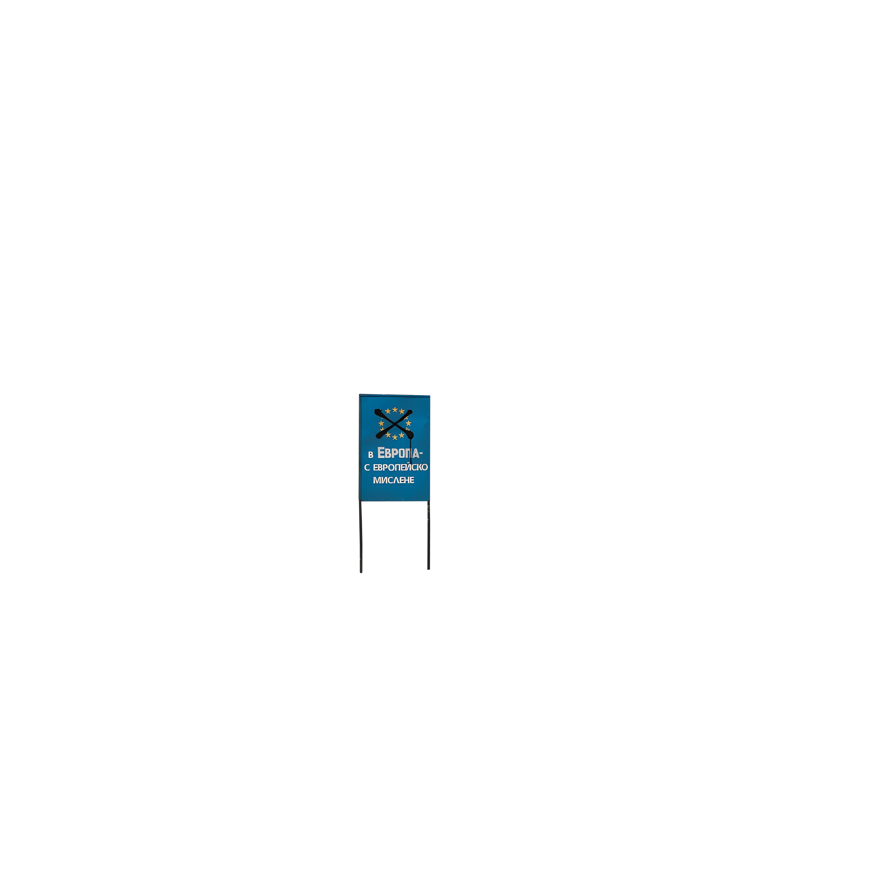
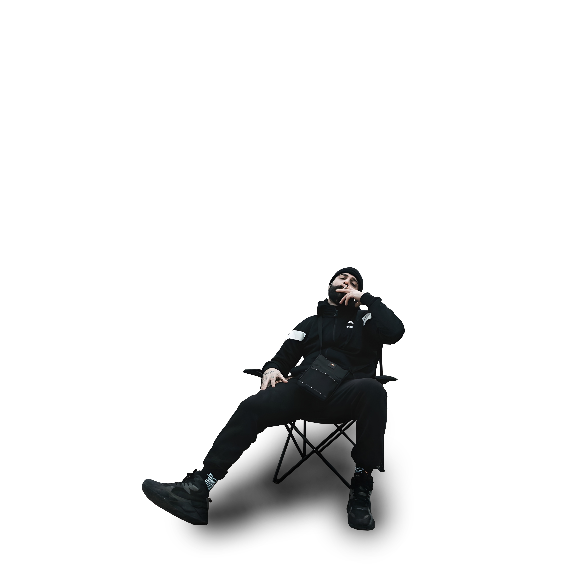

# **About the project:**
## What is this project about ?
This simple project is an **interactive parallax wallpaper made for the app Lively Wallpaper**, but it should work for any live wallpaper app that uses html/css/javascript. It is a really basic parallax wallpaper of some album art.


## Can I modify it and use it, and if so, how ?
**Yes, this project is open source and you are free to modify it and share it to your heart's content.** It is really easy to set up a new parallax wallpaper with it, a, and it has some small but pretty powerful features that I go into more detail about in the project's documentation.

## Will this project receive updates and fixes in the future ?
This is a pretty small project, so **I can't promise that I'll keep on supporting it long term**, but I don't expect it to need much support either since it's pretty basic. I did however really enjoy making it, and look forward to using it in larger projects, such as an app that can generate a parallax wallpaper on its own when given an image, using this template.

# **Documentation:**
## Set up a basic parallax wallpaper
Setting up a new parallax wallpaper can be broken down into two easy steps:
  1. Drag your layers into the `layers` folder. I recommend numbering your layers so that it's easier to know in which order you want to have them, and reordering them becomes easier in case you want to make changes later.
<br>
> [!WARNING]
> It works better with square images of the same resolution, or at least images of the same aspect ration.
  
  3. Go over to the `index.html`, and add all of your images through `` tags in the `div` with an id of `layer-container`.
  ```html
  <div id="layer-container">
    
    
    
    
    
    
    
  </div>
```
> [!WARNING]
> Don't forget to give your image the `layers` class or it will not work.

And that's it! You now have a working parallax wallpaper, that you can see how to use with lively wallpaper [here](#import-into-lively-wallpaper).

## Additional features
If you want to customize your parallax wallpaper further, here are a few additional features you can take advantage of:

### The `fit` class:
This class makes an image fit into frame by setting itswidth and height to `100vh`. Images used as the background of your parallax effect should not have this class, except if they have the perfect aspect ratio, as you want them to cover the whole screen.
```css
.fit {
  height: 100vh;
  width: 100vh;
}
```

### The `fill` class:
This class is the opposite of the `fit` class, setting the image's width and height to `110vw` and `100vw` respectively. It is meant for the images at the back of the parallax effect that have to cover the entire screen, with some overflow so that when they move around the background doesn't show.
```css
.fill {
  height: 100vw;
  width: 110vw;
}
```

### The `top` and `bot` classes:
These classes will only affect the end result if they are added to an image that already has the `fill` class. They are meant for elements that are overflowing on the top and bottom due to the `fill` class. The `bot` class will make the bottom of the image anchored to the bottom of the screen, and the `top` class will anchor the top of the image to the top of the screen. They should be used when an image has a lot of content on the top or bottom side and is completely transparent in the middle, so it ends up disappearing because the images are centered by default.
> [!IMPORTANT]
> The JavaScript that handles the parallax effect handles all four of the above classes somewhat separately, so if you are having problems, try changing classes or modifying the JavaScript.

## Import into lively wallpaper:
Once you have finished making your parallax wallpaper, you simply have to follow these five final steps to see it on your desktop:

1. Open lively wallpaper
2. Open the wallpaper folder
   Navigate to any wallpaper on the home screen, and press the three dots under the preview gif. Select `Open File Location` and the wallpaper folder should open.
3. Put your wallpaper in the wallpaper folder
   Copy the whole folder you made the wallpaper in, just like it is right here on GitHub, and paste it into the wallpaper folder.
4. Restart lively wallpaper
5. Select your wallpaper

> [!IMPORTANT]
> For the wallpaper to appear properly in lively wallpaper if you modified my work, you have to add a few things, such as a preview image named `thumbnail.png`, a preview gif named `preview.gif` and modify the contents of the `LivelyInfo.json` for it to have the correct name. If you take it further and want to add setting to your wallpaper that you can modify through lively wallpaper, you can make these with the `LivelyProperties.json` file, but you will also have to implement them in JavaScript so I recommend opening other wallpapers in the wallpaper folder to see how they work.
